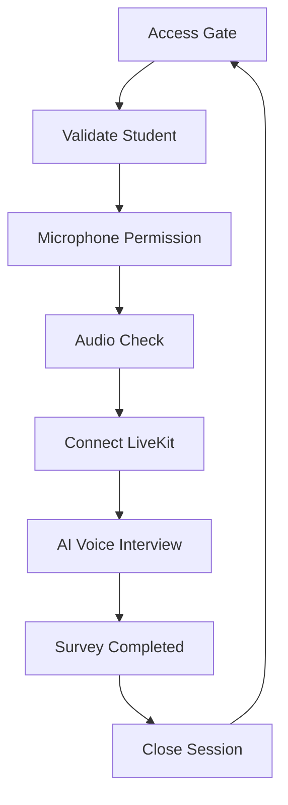

# Product Requirement Document

# Voice Survey Student App

**Product:** `frontendapp`  
**Version:** 1.0  
**Platform:** Web  
**Primary Users:** Grade 7–8 students, approximately 12–15 years old  
**Core Technology:** React / Next.js / Vite + LiveKit WebRTC

---

# 1. Product Overview

## 1.1 Vision

The Voice Survey Student App is a frictionless web application that allows middle-school students to participate in voice-based psychological, learning, and memory surveys conducted by an AI interviewer.

The student should be able to go from:

```text
School Code + Student ID
        ↓
Microphone Check
        ↓
AI Voice Interview
        ↓
Completion
```

without creating an account.

The core experience should feel like a calm conversation rather than a traditional survey form.

---

# 2. Problem Statement

Traditional survey interfaces create unnecessary friction for students:

- Login requirements
- Passwords
- Long forms
- Text-heavy questions
- Complex instructions
- Poor engagement

The application replaces this with a short access flow followed by a real-time AI voice interview.

---

# 3. Goals

## Primary Goals

1. Allow students to start a survey without registration.
2. Connect students to the correct LiveKit voice room.
3. Provide a reliable real-time AI voice conversation.
4. Clearly communicate microphone and connection states.
5. Display live conversational subtitles.
6. Show lightweight survey progress.
7. Handle temporary network interruptions gracefully.
8. Confirm successful survey completion.

---

# 4. Non-Goals

The frontend does not need to provide:

- Student accounts
- Password authentication
- Student dashboards
- Survey creation
- Survey question management
- AI model configuration
- Billing
- Administrative analytics
- Teacher dashboards
- Long-term student profile management

Those responsibilities belong outside the student frontend.

---

# 5. Target User

## Student

Typical user:

- Age: 12–15
- Grade: 7 or 8
- Uses a school-provided tablet, laptop, desktop, or browser
- May have limited technical knowledge
- May be uncomfortable with complicated forms
- Needs immediate feedback when microphone/audio/network states change

The UI must therefore be understandable without technical knowledge.

---

# 6. Core User Journey



---

# 7. Application States

The frontend should maintain a clear finite state machine.

```text
ACCESS
   ↓
VALIDATING
   ↓
MIC_PERMISSION
   ↓
MIC_CHECK
   ↓
CONNECTING
   ↓
INTERVIEW
   ↓
SUBMITTING
   ↓
COMPLETE
```

Error states may occur at any point:

```text
ERROR
  ↓
RETRY
```

---

# 8. Screen 1 — Access Gate

## Objective

Allow the student to enter their assigned survey session in less than five seconds.

## Required Fields

### School Code

Format:

```text
4–8 character alphanumeric code
```

Example:

```text
SCH-804
```

---

### Student ID

Example:

```text
STU-1029
```

---

### Student Name

Optional.

Can be:

- Full name
- Nickname
- Pre-filled value

---

### Grade

Allowed values:

```text
Grade 7
Grade 8
```

Default:

```text
Grade 8
```

---

## Primary CTA

```text
Start Voice Survey
```

The CTA must remain disabled until required fields are valid.

---

# 9. Access API

## Endpoint

```http
POST /start_call
Content-Type: application/json
```

## Request

```json
{
  "school_code": "SCH-804",
  "student_id": "STU-1029",
  "name": "Alex",
  "grade": "Grade 8"
}
```

## Response

```json
{
  "room_name": "chat-8e8a2f35",
  "token": "eyJhbGciOiJIUzI1NiIsInR5cCI6IkpXVCJ9...",
  "ws_url": "ws://127.0.0.1:8880"
}
```

The frontend stores the session information in application state.

---

# 10. Access Validation

The frontend must handle:

### Success

Move to microphone permission/check.

### Invalid School Code

Display:

```text
We couldn't find that school.
Please check your school code.
```

### Invalid Student ID

Display:

```text
We couldn't find that student ID.
Please check the ID and try again.
```

### Server Error

Display:

```text
Something went wrong.
Please try again.
```

### Network Error

Display:

```text
Unable to connect.
Check your internet connection and try again.
```

The student should remain on the access screen.

---

# 11. Screen 2 — Microphone Check

## Objective

Confirm that:

1. Browser microphone permission exists.
2. A microphone device is available.
3. Audio input is being detected.
4. The student understands that their microphone works.

---

# 12. Microphone Permission Flow

If permission is not granted:

```text
Allow microphone access

Your microphone lets the interviewer hear
your answers.

[ Allow Microphone ]
```

Once permission is granted, transition to the audio check.

---

# 13. Audio Level Detection

Use the Web Audio API.

Recommended approach:

```text
MediaStream
    ↓
AudioContext
    ↓
AnalyserNode
    ↓
Amplitude calculation
    ↓
Audio visualization
```

The frontend should determine whether meaningful audio input is detected.

---

# 14. Audio Check States

## Waiting

```text
Speak normally to test your microphone.
```

## Audio Detected

```text
Microphone working
```

Enable:

```text
Join Interview
```

## No Audio

```text
We can't hear anything yet.

Try saying "Hello".
```

## Permission Denied

```text
Microphone access is blocked.

Allow microphone access in your browser
settings before continuing.
```

---

# 15. Screen 3 — Live AI Voice Room

This is the primary product experience.

The interface must prioritize:

1. AI audio
2. Student audio
3. Current transcript
4. Survey progress
5. Essential controls

Everything else should be secondary.

---

# 16. LiveKit Connection

Use:

```text
livekit-client
@livekit/components-react
```

Connection requires:

```text
room_name
token
ws_url
```

The frontend connects only after the access gate has successfully returned a valid session.

---

# 17. AI Voice Visualization

The central AI representation should be an animated audio orb.

## Idle

Soft breathing animation.

## AI Speaking

The orb reacts to incoming audio amplitude.

## Student Speaking

Show microphone activity using ripples around the interaction area.

## AI Listening

Reduce the orb animation and emphasize the student audio state.

---

# 18. Live Transcript

The interface should show the current conversation.

### AI

```text
What helps you understand something new?
```

### Student

```text
When someone gives me an example...
```

The student transcript may be updated continuously while speech recognition is active.

The UI should prioritize the current question rather than displaying a large historical transcript.

---

# 19. Conversation States

## AI Thinking

```text
Thinking...
```

## AI Speaking

Display current AI question.

## Student Speaking

```text
Listening...
```

Display live student transcript.

## Processing

Briefly indicate that the response is being processed.

---

# 20. Barge-In

The application must support visual feedback when the student begins speaking while the AI is talking.

Expected behavior:

```text
AI Speaking
     ↓
Student starts speaking
     ↓
AI visual contracts
     ↓
Student audio indicator activates
     ↓
AI stops/interrupts according to backend behavior
```

Visual feedback must appear immediately.

Target:

```text
<100ms UI response
```

The exact AI interruption behavior is controlled by the voice backend.

---

# 21. Survey Progress

Show lightweight progress.

Example:

```text
SECTION B · TEACHING STYLE

━━━━━━━━━━━━━━━━━━━━━━━━━━━━░░░

6 / 10
```

The frontend should receive or derive progress information from the survey session.

If the backend does not provide section information, the frontend should not invent it.

---

# 22. Control Dock

Required controls:

### Microphone

Toggle local microphone track.

States:

```text
Unmuted
Muted
```

### Speaker

Allow incoming AI audio to be muted or adjusted.

### End Survey

Opens a confirmation dialog.

---

# 23. End Survey Behavior

When the student presses End Survey:

```text
End the survey?

Your answers so far will be submitted.

[ Continue Survey ]

[ End Survey ]
```

If confirmed:

1. Stop local microphone.
2. Disconnect LiveKit.
3. Submit/finalize the session.
4. Clear temporary session state.
5. Navigate to completion screen.

---

# 24. Network Reconnection

The frontend must support temporary network failures.

Expected flow:

```text
Connected
   ↓
Network interruption
   ↓
Reconnecting...
   ↓
Connected
```

The current screen should remain visible.

The student should not lose the entire survey merely because of a temporary connection problem.

If reconnection permanently fails:

```text
We couldn't reconnect.

Please try again.
```

Provide an appropriate retry action.

---

# 25. Screen 4 — Completion

## Objective

Confirm that the interview has finished successfully.

Display:

```text
You're all done.

Thanks for sharing your thoughts.
```

Optional metrics:

```text
10 questions answered
08:42 interview time
```

These values must come from actual session data.

---

# 26. Completion API / Session Finalization

The frontend should finalize the session after the survey ends.

The exact endpoint is backend-dependent and should be defined before implementation.

Minimum expected frontend behavior:

```text
Finalize
   ↓
Receive success
   ↓
Disconnect
   ↓
Clear session
   ↓
Completion screen
```

---

# 27. Session Management

Client-side session state should contain only information required for the current survey.

Example:

```ts
interface SurveySession {
  schoolCode: string;
  studentId: string;
  name?: string;
  grade: string;

  roomName: string;
  token: string;
  wsUrl: string;

  status:
    | "access"
    | "mic_check"
    | "connecting"
    | "interview"
    | "completing"
    | "complete";

  questionCount?: number;
  currentQuestion?: number;
  section?: string;
}
```

Sensitive session credentials should not be unnecessarily persisted to long-term browser storage.

---

# 28. State Management

Recommended:

```text
Zustand
```

or React Context for a smaller implementation.

Suggested stores:

```text
sessionStore
audioStore
surveyStore
connectionStore
```

Avoid introducing complex global state unless required.

---

# 29. Frontend Architecture

Recommended structure:

```text
frontendapp/
├── app/
│   ├── page
│   ├── access
│   ├── mic-check
│   ├── interview
│   └── complete
│
├── components/
│   ├── access/
│   ├── audio/
│   ├── interview/
│   ├── completion/
│   └── ui/
│
├── hooks/
│   ├── useLiveKit
│   ├── useMicrophone
│   ├── useAudioLevel
│   └── useSurveySession
│
├── store/
│   ├── sessionStore
│   ├── audioStore
│   └── surveyStore
│
├── lib/
│   ├── api
│   ├── livekit
│   └── audio
│
└── styles/
    └── globals.css
```

---

# 30. Technology Stack

| Layer | Technology |
|---|---|
| Framework | Next.js 14 or Vite + React |
| Language | TypeScript |
| Styling | Vanilla CSS or TailwindCSS |
| Animation | Framer Motion |
| Voice | LiveKit |
| WebRTC | LiveKit WebRTC |
| Audio Analysis | Web Audio API |
| State | Zustand / React Context |
| API | REST |
| Deployment | Web |

---

# 31. API Layer

Create a dedicated API client.

Example:

```ts
startSurvey({
  schoolCode,
  studentId,
  name,
  grade
});
```

The UI should never directly scatter `fetch()` calls throughout components.

Centralize API behavior.

---

# 32. Error Handling

Every network operation must have:

```text
Loading
Success
Error
Retry
```

At minimum handle:

- Invalid credentials
- Backend unavailable
- Request timeout
- Microphone denied
- No microphone
- LiveKit connection failure
- LiveKit disconnection
- Reconnection failure
- Survey finalization failure

Errors should be written in student-friendly language.

Avoid technical messages such as:

```text
WebRTC ICE failure
401 Unauthorized
LiveKit room connection error
```

Instead:

```text
We couldn't connect you to the interview.
Please try again.
```

Technical details should remain in developer logs.

---

# 33. Performance Requirements

## Voice Latency

Target:

```text
<500ms
```

Preferred:

```text
<400ms
```

This depends on the backend, network, LiveKit configuration, and voice pipeline.

The frontend should minimize additional latency introduced by its own processing.

---

# 34. Audio Visualization Performance

Audio visualization should run independently from React render cycles where possible.

Prefer:

```text
requestAnimationFrame
```

or optimized animation primitives rather than causing high-frequency React state updates.

Avoid updating React state for every audio sample.

---

# 35. Browser Requirements

Support modern:

- Chrome
- Edge
- Safari
- Firefox

Primary environments:

- School laptops
- Windows desktops
- iPads
- Android tablets

The app should work without requiring installation.

---

# 36. Responsive Requirements

## Desktop

```text
≥ 1024px
```

Use large central composition.

## Tablet

```text
768px–1023px
```

Optimize for touch.

## Mobile

```text
<768px
```

Use single-column layout and compact controls.

---

# 37. Accessibility

Required:

- Keyboard navigation
- Visible focus states
- Screen-reader labels
- Minimum 44×44px touch targets
- Text-based state indicators
- Sufficient contrast
- Reduced-motion support
- No color-only status indicators

---

# 38. Privacy & Session Safety

Because students are minors, the frontend should minimize retained personal information.

Requirements:

- No unnecessary local persistence
- Clear session cleanup
- Do not expose tokens in visible UI
- Disconnect LiveKit when session ends
- Clear temporary state after completion
- Do not log student answers in browser console
- Do not store microphone recordings locally unless explicitly required by the backend

---

# 39. Security

The frontend must treat the `/start_call` response as session credentials.

Requirements:

- Use HTTPS in production.
- Use secure WebSocket configuration in production.
- Never hardcode LiveKit tokens.
- Never expose backend secrets.
- Never place API secrets in client-side environment variables.
- Validate API responses before using them.

---

# 40. Acceptance Criteria

## Access Gate

- [ ] Student can enter school code.
- [ ] Student can enter student ID.
- [ ] Student can optionally enter name.
- [ ] Student can select Grade 7 or Grade 8.
- [ ] Required fields are validated.
- [ ] Start button remains unavailable until valid.
- [ ] API request is sent correctly.
- [ ] Loading state is visible.
- [ ] API errors are handled clearly.

## Microphone

- [ ] Browser microphone permission can be requested.
- [ ] Permission denial is handled.
- [ ] Microphone availability is detected.
- [ ] Audio level visualization works.
- [ ] Join button becomes available when appropriate.

## Live Interview

- [ ] LiveKit connection succeeds with returned credentials.
- [ ] AI audio is audible.
- [ ] Student microphone can be muted/unmuted.
- [ ] Speaker audio can be controlled.
- [ ] AI speaking state is visually represented.
- [ ] Student speaking state is visually represented.
- [ ] Transcript is visible.
- [ ] Progress is visible.
- [ ] Barge-in has immediate visual feedback.
- [ ] Temporary disconnections trigger reconnection.

## Completion

- [ ] Survey can be ended safely.
- [ ] Session is finalized.
- [ ] LiveKit disconnects.
- [ ] Session state is cleared.
- [ ] Completion screen appears.
- [ ] Completion metrics are accurate when available.
- [ ] Close Session returns to the initial access state.

---

# 41. UX Acceptance Criteria

The student should be able to understand:

```text
Where am I?
What should I do?
Is the microphone working?
Can the interviewer hear me?
Is the interviewer speaking?
How far am I?
Is my session connected?
How do I finish?
```

without needing technical instructions.

---

# 42. Design Requirements

The visual system should follow the accompanying design specification.

Core principles:

- Pure black background
- White primary typography
- Electric Iris `#8052ff` for primary actions
- Saffron Spark `#ffb829` for restrained highlights
- Lightweight typography
- Large-scale headings
- Minimal cards
- No heavy shadows
- Spacious composition
- Audio orb as the primary visual
- Subtle ambient particle field

The original visual reference explicitly uses black as the dominant canvas, violet as the primary action color, amber as an accent, and avoids borders/shadows in favor of whitespace.

---

# 43. Implementation Phases

## Phase 1 — Project Setup

- [ ] Initialize React/Next.js project.
- [ ] Configure TypeScript.
- [ ] Configure Tailwind or CSS architecture.
- [ ] Add typography.
- [ ] Add design tokens.
- [ ] Create application state model.

---

## Phase 2 — Access Gate

- [ ] Build access form.
- [ ] Add validation.
- [ ] Integrate `/start_call`.
- [ ] Add loading/error states.
- [ ] Store returned session.

---

## Phase 3 — Microphone

- [ ] Implement permission flow.
- [ ] Implement MediaStream.
- [ ] Implement Web Audio API analyser.
- [ ] Build audio level meter.
- [ ] Add microphone validation.

---

## Phase 4 — LiveKit

- [ ] Integrate `livekit-client`.
- [ ] Connect using returned token.
- [ ] Subscribe to AI audio.
- [ ] Publish student microphone.
- [ ] Implement mute/unmute.
- [ ] Implement connection status.
- [ ] Implement reconnection.

---

## Phase 5 — Interview UI

- [ ] Build Audio Orb.
- [ ] Add AI speaking animation.
- [ ] Add student speaking animation.
- [ ] Build transcript.
- [ ] Build progress indicator.
- [ ] Build control dock.
- [ ] Build end-session modal.
- [ ] Implement barge-in feedback.

---

## Phase 6 — Completion

- [ ] Build completion screen.
- [ ] Implement session finalization.
- [ ] Clear session state.
- [ ] Disconnect LiveKit.
- [ ] Implement Close Session.

---

## Phase 7 — Polish

- [ ] Responsive tablet layout.
- [ ] Mobile layout.
- [ ] Accessibility pass.
- [ ] Reduced-motion support.
- [ ] Connection failure testing.
- [ ] Microphone failure testing.
- [ ] End-to-end survey testing.
- [ ] Performance optimization.

---

# 44. Success Metrics

## Primary

### Pre-interview completion

Percentage of students who successfully reach the voice room after opening the app.

Target:

```text
>95%
```

---

### Voice connection success

Percentage of sessions successfully connected to LiveKit.

Target:

```text
>98%
```

---

### Survey completion

Percentage of students who begin the interview and reach completion.

Target:

```text
>90%
```

---

### Frontend latency contribution

Additional latency introduced by frontend processing should be minimized.

Target:

```text
<100ms additional processing overhead
```

---

# 45. Final Product Principle

The student should never feel like they are operating a complicated application.

The experience should be:

```text
Enter your code.

        ↓

Check your microphone.

        ↓

Talk to the interviewer.

        ↓

Finish.
```

The interface should become quieter as the voice experience becomes more important.

**The UI is the stage.  
The conversation is the product.**